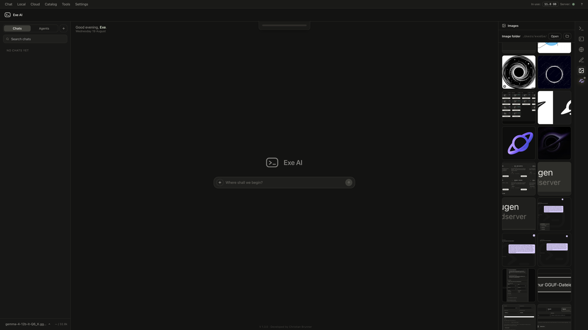
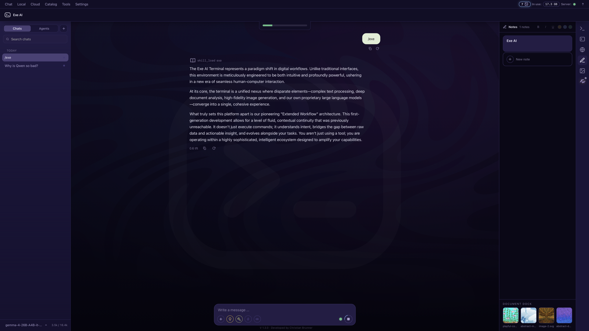
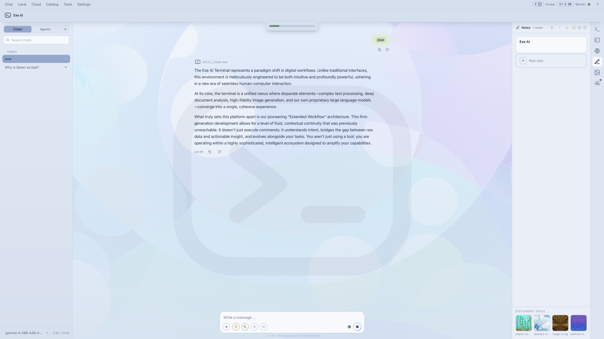
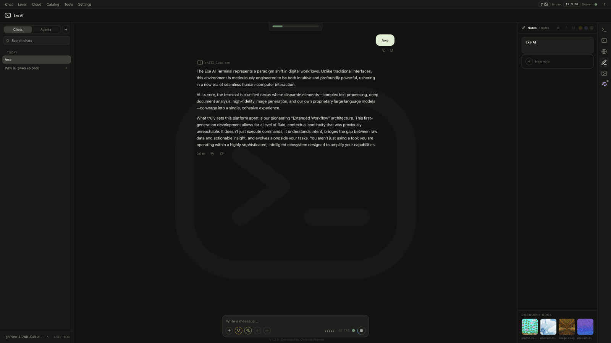
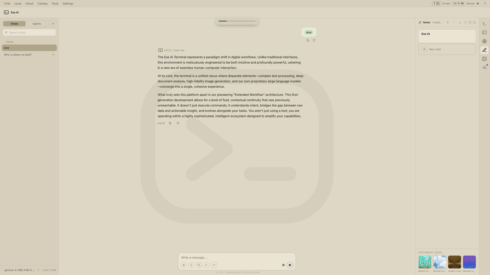
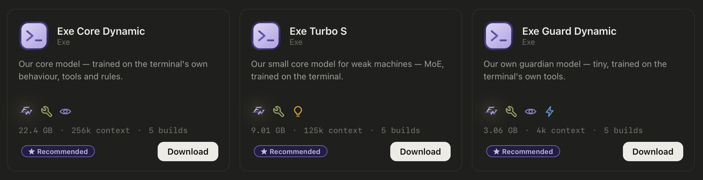
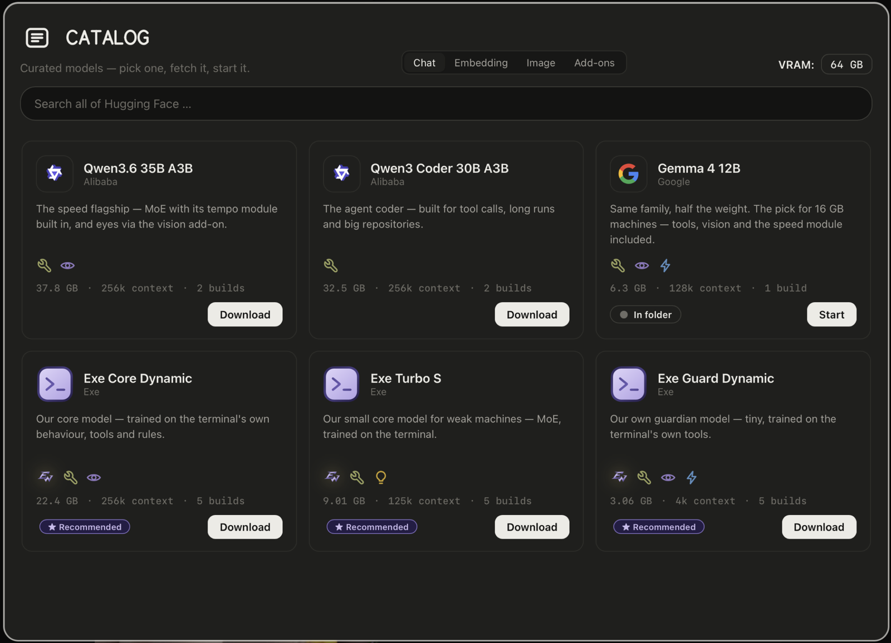
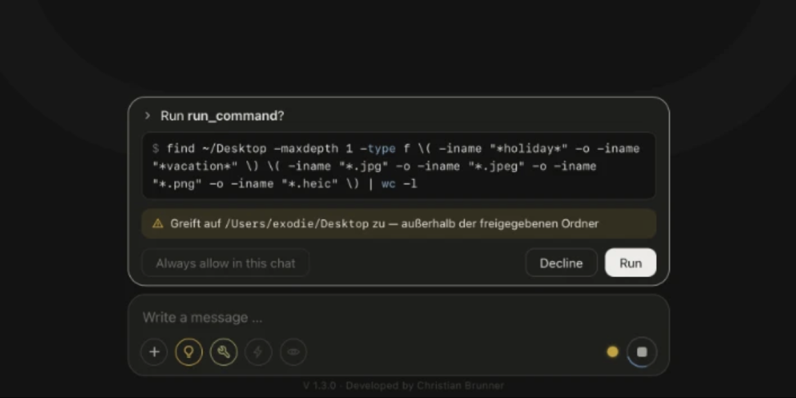

<p align="center">
  <picture>
    <source media="(prefers-color-scheme: dark)" srcset="docs/site/mark-dark.svg">
    
  </picture>
</p>

<h1 align="center">Exe AI</h1>

<p align="center"><b>Your models. Your machine.</b></p>

<p align="center">
  An AI agent harness that runs your entire workflow in a single window.<br>
  Text, documents, even images — all built into a beautifully designed piece of<br>
  software that keeps your data on your local storage.
</p>

<p align="center"><b>This is Exe AI.</b></p>

<p align="center">
  <a href="https://exe-hq.net"><b>Website</b></a>
  &nbsp;·&nbsp;
  <a href="https://exe-hq.net/docs/"><b>Documentation</b></a>
  &nbsp;·&nbsp;
  <a href="https://github.com/exe-ai-productions/exe-ai-terminal/releases/latest"><b>Download for macOS</b></a>
  &nbsp;·&nbsp;
  <a href="https://github.com/exe-ai-productions/exe-ai-terminal/releases/latest"><b>Download for Windows</b></a>
</p>

<p align="center">
  <a href="https://github.com/exe-ai-productions/exe-ai-terminal/releases/latest"></a>
  &nbsp;
  &nbsp;
  &nbsp;<a href="LICENSE.md"></a>
</p>

<p align="center"></p>

<p align="center">
  
</p>

<p align="center">
  Download a model, start it, talk to it, hand your agents tools and schedules —<br>
  nothing ever needs a terminal or a config file. Local models are the normal case,<br>
  not the exception; cloud providers are one key away, and nothing leaves your<br>
  machine unless you set that up yourself.
</p>

<p align="center"></p>

<p align="center">
  
</p>

<h2 align="center">Extended Workflow</h2>

<p align="center">
  <b>A tool call fails. A second model — yours, local, on its own port —<br>
  reads what went wrong and writes the corrected instruction.<br>
  You read it, and it is one click away from being sent.</b>
</p>

<table>
  <tr>
    <td width="33%" valign="top">
      <p><b>01 — Plain code spots the failure.</b></p>
      <p>Not a model, not a heuristic dressed up as one — the exit code, the stderr, the timeout. No tokens spent on noticing.</p>
    </td>
    <td width="33%" valign="top">
      <p><b>02 — A small model of your own writes the fix.</b></p>
      <p>It runs on its own port and never asks the chat's model, never a cloud endpoint — a branch in the code with no fallback.</p>
    </td>
    <td width="33%" valign="top">
      <p><b>03 — You decide.</b></p>
      <p>The suggestion stands in the rail with the finding beside it. One click sends it, one click drops it. Nothing runs behind your back.</p>
    </td>
  </tr>
</table>

<p align="center"></p>

##  What it does

<table>
  <tr>
    <td width="50%" valign="top">
      <p><b>Local models, end to end</b></p>
      <p>A curated GGUF catalogue sized to your machine's memory, a Hugging Face search, a one-button download and a built-in <code>llama-server</code> runner. Fetch, start, chat — no shell, no scripts.</p>
    </td>
    <td width="50%" valign="top">
      <p><b>Pictures, drawn on this machine</b></p>
      <p>stable-diffusion.cpp draws them behind an honest memory gate — sizes, steps, samplers, stackable LoRAs, a starting image with a brush for the part to redraw, and a queue. Nothing leaves the PC.</p>
    </td>
  </tr>
  <tr>
    <td width="50%" valign="top">
      <p><b>Long documents that fit</b></p>
      <p>Past a threshold a document is cut into overlapping sections, each carries a vector from a local embedding model, and a question brings along only the passages that fit it — section numbers named.</p>
    </td>
    <td width="50%" valign="top">
      <p><b>A memory that grows with you</b></p>
      <p>The assistant saves what should still hold next week and retrieves it on demand. Local models get it by default, cloud models only if you switch that on.</p>
    </td>
  </tr>
  <tr>
    <td width="50%" valign="top">
      <p><b>Agents, jobs and schedules</b></p>
      <p>Reusable agent files — Markdown with front matter — one-off or scheduled runs, a step-by-step log and a final report. Missed runs are skipped, never stacked.</p>
    </td>
    <td width="50%" valign="top">
      <p><b>Tools that ask first</b></p>
      <p>Eight built-in tools and any MCP server. The shared folder is the permission: no shared folder, no file access — and reaching outside stops and asks.</p>
    </td>
  </tr>
  <tr>
    <td width="50%" valign="top">
      <p><b>It knows who it works for</b></p>
      <p>The first start asks your name, your language, light or dark. From then on the empty chat greets you by name — and one switch rules it all. Off means off, everywhere.</p>
    </td>
    <td width="50%" valign="top">
      <p><b>Two languages, real maker marks</b></p>
      <p>English and German at runtime, error messages included. Catalogue cards carry the original vendor vector of their model family — never redrawn, never guessed.</p>
    </td>
  </tr>
</table>

<p align="center"></p>

##  One program, four worlds

Pick a skin and the whole surface follows — the frame, every line, every bubble, the code blocks.

<table>
  <tr>
    <td width="50%" align="center"><br><b>Dark Matter</b></td>
    <td width="50%" align="center"><br><b>Heaven</b></td>
  </tr>
  <tr>
    <td width="50%" align="center"><br><b>Exe</b></td>
    <td width="50%" align="center"><br><b>Pearl</b></td>
  </tr>
</table>

Plus code colour sets — Exe, Tokyo Night, One Light — three text sizes, outline messages, and your own bubble colour with ink that flips between light and dark on its own.

<p align="center"></p>

##  Three models of our own

Trained on the terminal itself — its tools, its folder rules, its limits. Not on facts, on behaviour.

<table>
  <tr>
    <td width="33%" valign="top">
      <p><b>Exe Core Dynamic</b><br><sub>THE CORE MODEL · QWEN 3.8 · 27B</sub></p>
      <p>Knows every built-in tool and reads tool schemas it has never seen. The recommended choice for machines with room.</p>
      <ul>
        <li><b>262,144</b> context window</li>
        <li>Extended Workflow · tools · vision</li>
        <li>Five builds, 10.9–22.4 GB</li>
      </ul>
    </td>
    <td width="33%" valign="top">
      <p><b>Exe Turbo S</b><br><sub>THE SMALL ONE · LFM 2.5 · 8.3B MOE</sub></p>
      <p>For machines with 6–8 GB of memory: computes with only 1.5 of its 8.3 billion parameters per token.</p>
      <ul>
        <li><b>128,000</b> context window</li>
        <li>Extended Workflow · tools · thinking</li>
        <li>Five builds, 3.8–9.0 GB</li>
      </ul>
    </td>
    <td width="33%" valign="top">
      <p><b>Exe Guard Dynamic</b><br><sub>THE GUARDIAN · QWEN 3.5 4B</sub></p>
      <p>Tiny and fast: reads a failed tool step and names the one instruction that fixes it. Built for Extended Workflow.</p>
      <ul>
        <li><b>4,096</b> context — answer time is the point</li>
        <li>Extended Workflow · tools · vision</li>
        <li>Five builds, 1.2–3.1 GB</li>
      </ul>
    </td>
  </tr>
</table>

<p align="center">
  
</p>

And every model you already know: the curated catalogue builds on the open model world, every entry started, shown an image and asked to call tools before it made the list — plus LM Studio, Ollama and MLX if you already run them, and Anthropic, OpenAI or any OpenAI-compatible endpoint one key away.

<p align="center">
  
</p>

<p align="center"></p>

##  Tools that ask first

**The shared folder is the permission.** No shared folder, no file access — not as a setting, as the architecture. Anything reaching outside your shared folders stops and asks first, right above the input field.

| Tool | What it does |
|---|---|
| `run_command` | Shell commands inside your shared folders — foreground or background. Anything reaching outside asks first. |
| `read_file` / `list_dir` | Look without touching: reading can stay on while writing stays off. |
| `write_file` / `edit_file` | Writing creates, editing replaces one passage — and refuses with a reason if the old text isn't found exactly once. |
| `memory_save` | Appends or replaces one entry. It cannot delete, and it cannot write whole files. |
| `skill_load` / `skill_save` | Skills are little procedures the assistant loads on demand — or writes for you. |
| `ask_user` | Hands the decision back: the run pauses, you answer, it continues. |
| `web_search` | Ships with the program — no account, no key, runs locally. Or point it at your own SearXNG. |

Everything beyond that speaks **MCP**: Notion, GitHub, Figma, Gmail, Recraft, Hugging Face — or your own server. Sensitive actions stop and ask, and a tool's output is treated as **data, never as new orders** — a web page cannot re-instruct the assistant.

<p align="center">
  
</p>

<p align="center"></p>

##  Built for privacy

- The service binds to **127.0.0.1**. Chats, settings, keys and models live in local files and a local SQLite database.
- API keys go into a local file with tight permissions and are never displayed again — the interface only ever learns *whether* a key is set.
- The optional memory travels to cloud providers only if you switch that on. The same honesty applies to your name.
- Model downloads talk to huggingface.co directly; the model search runs through the service, so your browser never contacts a third party.
- The model server gets a fresh key at every start, and the service turns away cross-origin writes — web pages in your browser cannot knock on your local ports.
- Extended Workflow's guardian never asks the chat's model and never a cloud endpoint — a branch in the code with no fallback.

<p align="center"></p>

##  Quick start

### Packaged — the normal way

Grab the build for your system from the [latest release](https://github.com/exe-ai-productions/exe-ai-terminal/releases/latest). No account, no setup wizard.

- **macOS (Apple Silicon)** — open the `.dmg`, drag the app into Applications. Signed and notarized with Apple.
- **Windows (x64)** — one `.exe`; keep it wherever you like and run it.

### From source

```bash
git clone https://github.com/exe-ai-productions/exe-ai-terminal
cd exe-ai-terminal
python3 -m venv .venv
.venv/bin/pip install -r requirements.txt
.venv/bin/uvicorn app.main:app --host 127.0.0.1 --port 8090
```

Then open `http://127.0.0.1:8090/app/`. For local models, install [llama.cpp](https://github.com/ggml-org/llama.cpp) — or let the Local view fetch `llama-server` for you, exactly like the packaged app does. The test suite runs with `.venv/bin/pytest`.

<p align="center"></p>

##  HTTP API

The window talks to a plain HTTP API on your machine — and so can your scripts.

| Address | Purpose |
|---|---|
| `/health` | Service status — fixed address for monitoring |
| `/api/v1/meta` | Features, languages, version |
| `/api/v1/models` | Reachable endpoints with their reported model names |
| `/api/v1/chats` | Create, list, rename, delete chats |
| `/api/v1/chat/completions` | Generate a response (Server-Sent Events) |
| `/api/v1/tools` | Available tools (MCP) |
| `/api/v1/agents`, `/api/v1/jobs` | Agents and their runs |
| `/docs` | Interactive API documentation, served by the app itself |

<p align="center"></p>

##  License

[PolyForm Noncommercial 1.0.0](LICENSE.md) — in plain words: use it, change it and share it freely for anything personal, educational or otherwise noncommercial. Using it commercially — in a company, for paid work — needs a commercial license: write to **dev@exe-hq.net**.

<p align="center"></p>

<p align="center">
  <picture>
    <source media="(prefers-color-scheme: dark)" srcset="docs/site/mark-dark.svg">
    
  </picture>
</p>

<p align="center">
  <a href="https://exe-hq.net"><b>exe-hq.net</b></a>
  &nbsp;·&nbsp;
  <a href="https://exe-hq.net/docs/">Docs</a>
  &nbsp;·&nbsp;
  <a href="https://github.com/exe-ai-productions/exe-ai-terminal/releases">Releases</a>
  &nbsp;·&nbsp;
  <a href="https://exe-hq.net/impressum.html">Legal Notice</a>
  &nbsp;·&nbsp;
  <a href="https://exe-hq.net/datenschutz.html">Privacy Policy</a>
</p>

<p align="center"><sub>© 2026 Exe AI Productions</sub></p>
