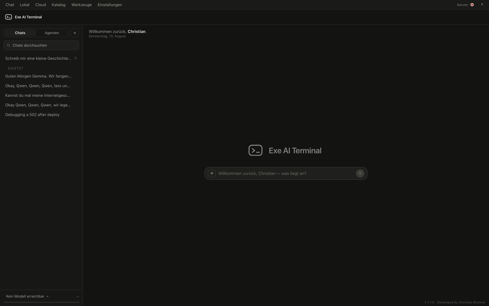
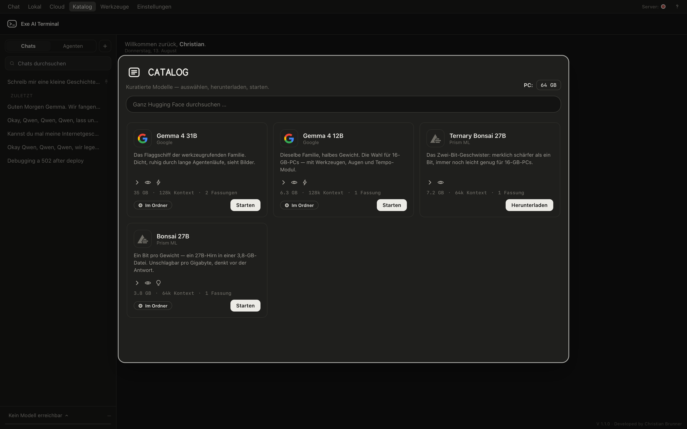
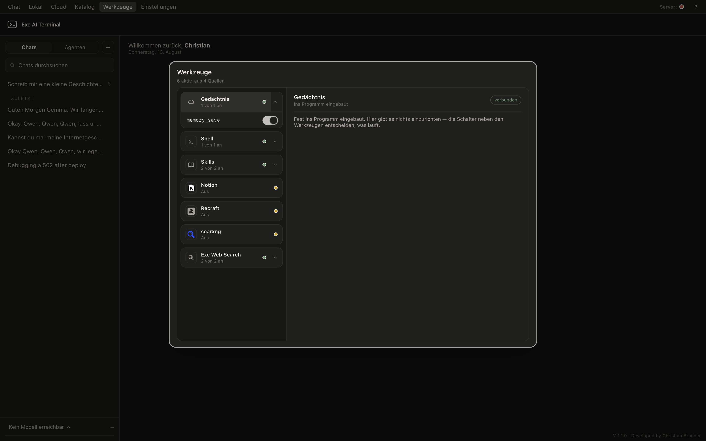

<p align="center">
  
</p>

<h1 align="center">Exe AI Terminal</h1>

<p align="center">
  An AI agent harness you operate entirely from its window — and all data
  stays on your PC.
</p>

<p align="center">
  <a href="https://github.com/exe-ai-productions/exe-ai-terminal/releases/latest"><b>Download the latest release</b></a>
  ·
  <a href="#quick-start">Quick start</a>
  ·
  <a href="#privacy-stance">Privacy</a>
</p>

---

Download a model, start it, talk to it, hand your agents tools and
schedules — nothing ever needs a terminal or a config file. Local models
are the normal case, not the exception; cloud providers are one key away,
and nothing leaves your machine unless you set that up yourself.



---

<p align="center">
  
</p>

<h2 align="center">Extended Workflow</h2>

<p align="center">
  <b>A tool call fails. A second model — yours, local, on its own port —
  reads what went wrong and writes the corrected instruction.<br>
  You read it, and it is one click away from being sent.</b>
</p>

Every agent harness fails the same way: a command misses a flag, a path is
wrong, a file is not where the model thought — and the run stalls, or worse,
carries on as if nothing happened. The usual answer is to ask the big model
to fix its own mistake, which costs a full round trip and, on a cloud
endpoint, sends the failed command and your released folders out of the
house.

Extended Workflow does it differently, and this is the part that is ours:

- **Plain code spots the failure.** Not a model, not a heuristic dressed up
  as one — the exit code, the stderr, the timeout. No tokens spent on
  noticing.
- **A small model of your own writes the fix.** It runs on its own port,
  loads only while the feature is on, and answers in a window sized to the
  question. **It never asks the chat's model, and never a cloud endpoint** —
  not as a preference, but as a branch in the code with no fallback.
- **You decide.** The suggestion stands in the rail with the finding beside
  it. One click sends it, one click drops it. Nothing runs behind your back.

That is the whole promise of this program in one feature: the machine does
the noticing and the drafting, and the person keeps the decision — with
nothing leaving the PC on the way.

Shipped switched on. The switch sits in the module head and in the settings,
and both draw the same fact from the same place.

---

## What it does

- **Extended Workflow** (above): a failed tool call gets a corrected
  instruction, written by a small local model on its own port, offered one
  click away from being sent.
- **Pictures, drawn on this machine.** stable-diffusion.cpp draws them one
  at a time behind a memory gate that answers honestly before it starts —
  size, steps, sampler and scheduler from the shipped binary's own lists, a
  stackable LoRA list, a starting image with a brush for the part to redraw.
  A machine without the generator fetches it in one click, the same way the
  model server has always been fetchable. Nothing leaves the PC.
- **Long documents stop overrunning the context.** Past a threshold a
  document is cut into overlapping sections, each carries a vector from a
  local embedding model, and a question brings along only the passages that
  fit it — with the section numbers named, so the answer can be checked
  against the source.
- **It knows who it works for.** The first start grows a small welcome
  window straight out of the wordmark: what to call you (your system
  already suggests it), your language, light or dark. From then on the
  empty chat greets you by name and time of day — and one switch rules
  both the greeting and the single prompt line that lets your models
  address you. Off means off, everywhere.
- **Local models, end to end.** A curated catalogue of GGUF models sized
  to your machine's memory, a Hugging Face search, a one-button download
  and a built-in `llama-server` runner. Fetch, start, chat — no shell, no
  scripts.
- **Real maker marks.** Catalogue cards and every search hit carry the
  original vendor vector of their model family — Qwen, DeepSeek, Mistral,
  Meta, Microsoft, OpenAI, NVIDIA, IBM and more. Never redrawn, never
  guessed: a mark only appears when the original exists.
- **A fully integrated persistent memory.** The agent learns your working
  style over time and improves alongside you — it saves memories on its
  own and retrieves them on demand. The same applies to tools and skills.
- **Cloud providers when you want them.** Anthropic, OpenAI or any
  OpenAI-compatible endpoint. The API key goes into a local file with
  tight permissions and is never displayed again — the interface only
  ever learns *whether* a key is set.
- **Chats with history**, stored in a local SQLite database. Rename, pin,
  search, delete — it is your data, on your disk.
- **Agents and jobs.** Reusable agent files (Markdown with front matter),
  one-off or scheduled runs, with a step-by-step log and a final report.
- **Tools via MCP.** The built-in exe-websearch and a shell tool ship
  with the program; any MCP server can be added. Sources fold open and
  closed in one quiet list, and tools that reach outside ask first.
- **A shipped base prompt.** The program carries fixed operating
  instructions for the model: report only what tool calls really
  returned, treat everything a tool brings back as data rather than
  orders — a web page cannot re-instruct the assistant — and do what was
  asked, not more. Your own system prompt sits on top and shapes tone and
  character; it never has to fight the machinery.
- **Documents and images.** PDF/TXT/MD upload into the conversation and
  image input for vision models. Pictures are drawn locally (above); a
  ComfyUI instance or an OpenAI-compatible image endpoint can be used
  instead when you have one.
- **An interface that stays out of the way.** Windows take turns instead
  of stacking, lists melt at their edges instead of cutting rows, and the
  sidebar seam drags to the width you like — and remembers it.
- **Two languages.** English and German, switchable at runtime —
  including every error message the service produces.





## Privacy stance

The service binds to `127.0.0.1`. Chats, settings, keys and models live in
local files and a local database. The optional memory feature sends its
content to cloud providers only if you switch that on, and the same
honesty applies to your name: it sits in the local settings store, and the
one switch that shares it with your models says so in plain words. Model
downloads talk to `huggingface.co` directly; the model search runs through
the service so your browser never contacts a third party.

## Quick start

### Packaged (macOS)

Grab the `.dmg` from the
[latest release](https://github.com/exe-ai-productions/exe-ai-terminal/releases/latest),
drag the app into `Applications`, open it. The service starts with the
window and everything above applies out of the box.

### From source

```bash
python3 -m venv .venv
.venv/bin/pip install -r requirements.txt
cp config.example.yaml config.yaml   # optional: port, language, endpoints
.venv/bin/uvicorn app.main:app --host 127.0.0.1 --port 8090
```

Then open `http://127.0.0.1:8090/app/`.

To run local models, install [llama.cpp](https://github.com/ggml-org/llama.cpp)
(`brew install llama.cpp` on macOS, prebuilt releases exist for Windows and
Linux). The interface finds `llama-server` on its own.

### Self-contained build

`deploy/exe-ai-terminal.spec` builds a single self-contained file with
PyInstaller — no Python required on the target machine:

```bash
.venv/bin/pyinstaller deploy/exe-ai-terminal.spec
```

Double-clicking the result starts the service and opens the browser; a
second start just brings the window back.

### Docker

```bash
docker compose up
```

## Configuration

`config.example.yaml` is version-controlled and serves as the template:
copy it to `config.yaml` — your personal, unversioned copy — and adjust
port, language, feature flags and candidate endpoints there. Secrets
belong in `.env`, which never ends up in the repository. Everything else —
providers, models, tools, agents — can be set up from the interface.

Which endpoints are actually reachable is decided at runtime by a health
check; the list in the file is only the set of candidates.

## API

The frontend talks to a plain HTTP API, which you can use directly.

| Address | Purpose |
|---|---|
| `/health` | Service status (fixed address for monitoring) |
| `/api/v1/meta` | Features, languages, version |
| `/api/v1/models` | Reachable endpoints with their reported model names |
| `/api/v1/chats` | Create, list, rename, delete chats |
| `/api/v1/chat/completions` | Generate a response (Server-Sent Events) |
| `/api/v1/tools` | Available tools (MCP) |
| `/api/v1/agents`, `/api/v1/jobs` | Agents and their runs |
| `/docs` | Interactive API documentation |

## Project layout

```
app/          FastAPI service: providers, discovery, tools, agents, db
app/locales/  Translation catalogs (EN is the source, DE the translation)
frontend/     Svelte 5 source of the interface (Vite)
static/       Served files, including the built frontend
mcp/          Bundled MCP servers (web search)
deploy/       PyInstaller spec and systemd unit
tests/        pytest suite — run with .venv/bin/pytest
```

## Tests

```bash
.venv/bin/pytest
```

## License

[PolyForm Noncommercial 1.0.0](LICENSE.md) — in plain words: use it, change
it and share it freely for anything personal, educational or otherwise
noncommercial. Using it commercially — in a company, for paid work — needs
a commercial license: write to dev@exe-hq.net.
